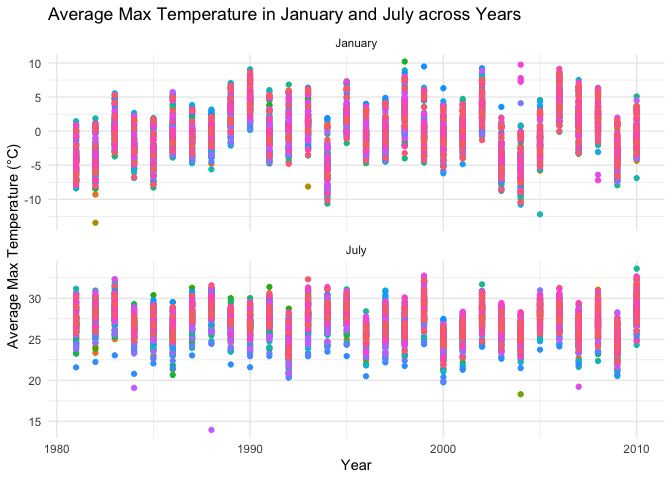
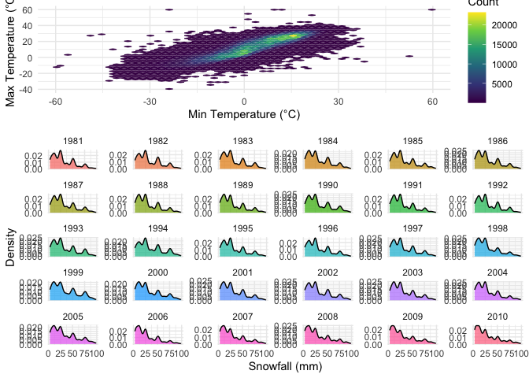
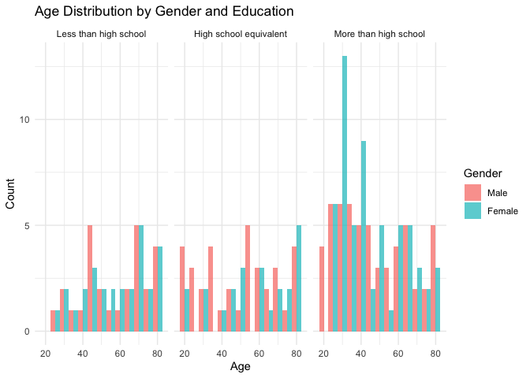
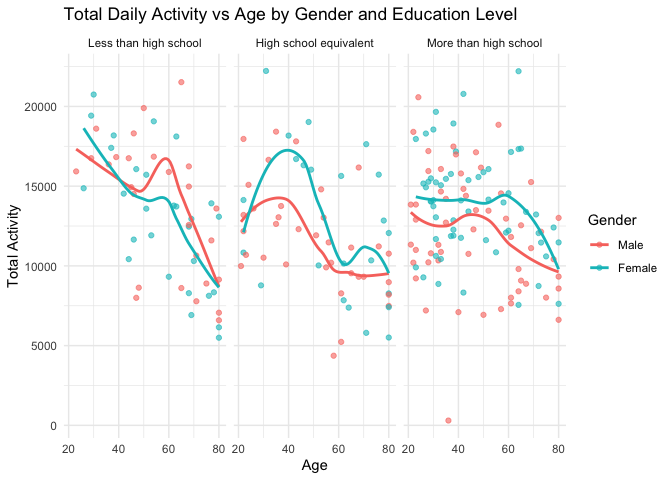
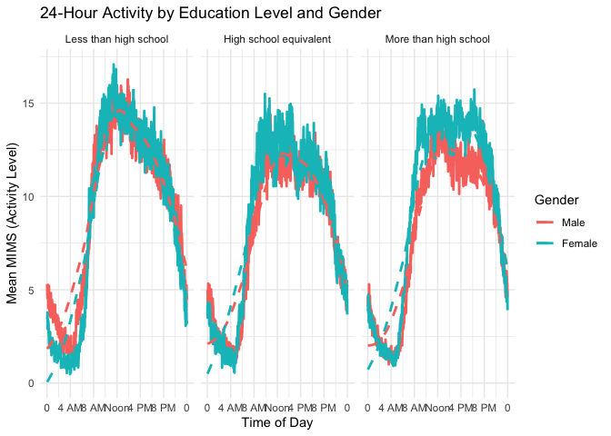
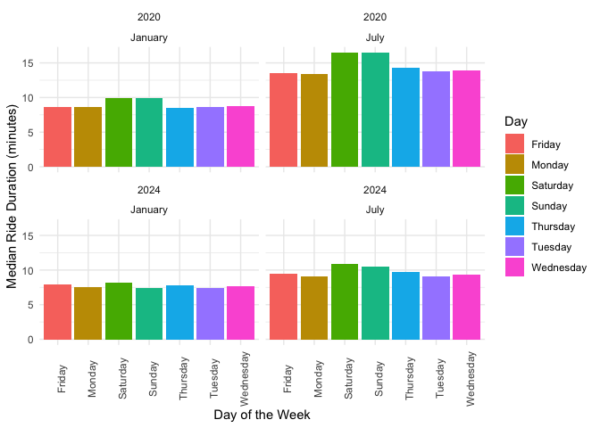
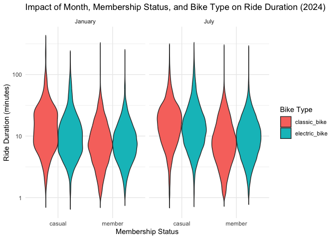

p8105_hw3_xq2241
================
Xinghao Qiao
2024-10-12

# question 1

``` r
#import data
library(p8105.datasets)
library(dplyr)
```

    ## 
    ## Attaching package: 'dplyr'

    ## The following objects are masked from 'package:stats':
    ## 
    ##     filter, lag

    ## The following objects are masked from 'package:base':
    ## 
    ##     intersect, setdiff, setequal, union

``` r
library(lubridate) 
```

    ## 
    ## Attaching package: 'lubridate'

    ## The following objects are masked from 'package:base':
    ## 
    ##     date, intersect, setdiff, union

``` r
library(ggplot2)
library(gridExtra)
```

    ## 
    ## Attaching package: 'gridExtra'

    ## The following object is masked from 'package:dplyr':
    ## 
    ##     combine

``` r
library(tidyr)
data("ny_noaa")
dim(ny_noaa)
```

    ## [1] 2595176       7

``` r
str(ny_noaa)
```

    ## tibble [2,595,176 × 7] (S3: tbl_df/tbl/data.frame)
    ##  $ id  : chr [1:2595176] "US1NYAB0001" "US1NYAB0001" "US1NYAB0001" "US1NYAB0001" ...
    ##  $ date: Date[1:2595176], format: "2007-11-01" "2007-11-02" ...
    ##  $ prcp: int [1:2595176] NA NA NA NA NA NA NA NA NA NA ...
    ##  $ snow: int [1:2595176] NA NA NA NA NA NA NA NA NA NA ...
    ##  $ snwd: int [1:2595176] NA NA NA NA NA NA NA NA NA NA ...
    ##  $ tmax: chr [1:2595176] NA NA NA NA ...
    ##  $ tmin: chr [1:2595176] NA NA NA NA ...
    ##  - attr(*, "spec")=List of 2
    ##   ..$ cols   :List of 7
    ##   .. ..$ id  : list()
    ##   .. .. ..- attr(*, "class")= chr [1:2] "collector_character" "collector"
    ##   .. ..$ date:List of 1
    ##   .. .. ..$ format: chr ""
    ##   .. .. ..- attr(*, "class")= chr [1:2] "collector_date" "collector"
    ##   .. ..$ prcp: list()
    ##   .. .. ..- attr(*, "class")= chr [1:2] "collector_integer" "collector"
    ##   .. ..$ snow: list()
    ##   .. .. ..- attr(*, "class")= chr [1:2] "collector_integer" "collector"
    ##   .. ..$ snwd: list()
    ##   .. .. ..- attr(*, "class")= chr [1:2] "collector_integer" "collector"
    ##   .. ..$ tmax: list()
    ##   .. .. ..- attr(*, "class")= chr [1:2] "collector_character" "collector"
    ##   .. ..$ tmin: list()
    ##   .. .. ..- attr(*, "class")= chr [1:2] "collector_character" "collector"
    ##   ..$ default: list()
    ##   .. ..- attr(*, "class")= chr [1:2] "collector_guess" "collector"
    ##   ..- attr(*, "class")= chr "col_spec"

``` r
# Calculate the frequency of missing data for each variable
missing<-ny_noaa |>
  summarize(across(everything(), ~sum(is.na(.)) )) |>
  pivot_longer(everything(), names_to = "variable", values_to = "freq_missing")

print(missing)
```

    ## # A tibble: 7 × 2
    ##   variable freq_missing
    ##   <chr>           <int>
    ## 1 id                  0
    ## 2 date                0
    ## 3 prcp           145838
    ## 4 snow           381221
    ## 5 snwd           591786
    ## 6 tmax          1134358
    ## 7 tmin          1134420

The raw dataset have 2595176 observation, with 7 variabvles; id
(chr),date (date),prcp(int),snow (int),snwd(int),tmax(chr) and tmin
(chr). And in the dataset, id and date don’t have misssing value. Prcp
has 145838 missing value, snow has 381221 missing value, snwd has 591786
missing value, tmax has 1134358 missing value and tmin has 1134420
missing value.

First, let’s do some data cleaning.

``` r
#Create separate variables for year, month, and day
ny_noaa <- ny_noaa |>
  mutate(year = year(date), month = month(date), day = day(date))
```

Then, we ensure observations for temperature, precipitation, and
snowfall are given in reasonable units.

``` r
ny_noaa <- ny_noaa |>
  mutate(
    tmax = as.numeric(tmax),
    tmin = as.numeric(tmin),
    month = as.numeric(month),
    prcp = prcp / 10,  # converting from tenths of mm to mm
    snow = snow,       
    tmax = tmax / 10,  # converting to degrees C
    tmin = tmin / 10   # converting to degrees C
  )
```

For the most commonly observed snowfall values, we have,

``` r
snowfall <- ny_noaa |>
  filter(!is.na(snow)) |>
  group_by(snow) |>
  summarize(count = n()) |>
  arrange(desc(count))

# View the most common snowfall values
head(snowfall)
```

    ## # A tibble: 6 × 2
    ##    snow   count
    ##   <int>   <int>
    ## 1     0 2008508
    ## 2    25   31022
    ## 3    13   23095
    ## 4    51   18274
    ## 5    76   10173
    ## 6     8    9962

From the output,we have the most commonly observed values for snowfall
is 0 mm.

Now, we draw the Two-panel plot for the average max temperature in
January and in July.

``` r
average_tmax <- ny_noaa |>
  filter(month %in% c(1, 7), !is.na(tmax)) |>
  group_by(id, year, month) |>
  summarize(mean_tmax = mean(tmax, na.rm = TRUE), .groups = "drop")

# Create the two-panel plot
ggplot(average_tmax, aes(x = year, y = mean_tmax, color = id)) +
  geom_point() +
  facet_wrap(~month, ncol = 1, scales = "free_y", labeller = as_labeller(c(`1` = "January", `7` = "July"))) +
  labs(
    title = "Average Max Temperature in January and July across Years",
    x = "Year",
    y = "Average Max Temperature (°C)",
    color = "Station ID"
  ) +
  theme_minimal()+ theme(legend.position = "none") 
```

<!-- -->
From the plot, we have observed that the average maximum temperature
shows seasonality,the average maximum temperature in January mainly
distributed between -10°C and 5°C across years and in July the
temperature mainly distributed between 25°C to 35°C.And there is no
clear long-term trend from the plot over the years between 1980 and
2010. Also, there are some outliers in the plot. For instance, there are
points lower than surrounding points in January of 1982 and in July of
1988.

Now, we will make a two-panel plot showing (i) tmax vs tmin for the full
dataset (note that a scatterplot may not be the best option); and (ii)
make a plot showing the distribution of snowfall values greater than 0
and less than 100 separately by year.

``` r
#panel 1 :tmax vs tmin for the full dataset 
panel1 <- ggplot(ny_noaa, aes(x = tmin, y = tmax)) +
  geom_hex(bins = 50) +  
  scale_fill_viridis_c() + 
  labs(
    x = "Min Temperature (°C)",
    y = "Max Temperature (°C)",
    fill = "Count"
  ) +
  theme_minimal()
# Panel 2: Distribution of snowfall values greater than 0 and less than 100, by year
panel2<- ggplot(ny_noaa |> filter(snow > 0 & snow < 100), aes(x = snow, fill = as.factor(year))) +
  geom_density(alpha = 0.7) +  
  facet_wrap(~year, scales = "free_y") +
  labs(
    x = "Snowfall (mm)",
    y = "Density"
  ) +
  theme_minimal() +
  theme(legend.position = "none")
# Arrange the two panels

grid.arrange(panel1, panel2, nrow = 2,heights = c(1, 2))
```

    ## Warning: Removed 1136276 rows containing non-finite outside the scale range
    ## (`stat_binhex()`).

<!-- -->

# question 2

First,let’s import the dataset.

``` r
library(readr)
accel <- read_csv("nhanes_accel.csv")
```

    ## Rows: 250 Columns: 1441
    ## ── Column specification ────────────────────────────────────────────────────────
    ## Delimiter: ","
    ## dbl (1441): SEQN, min1, min2, min3, min4, min5, min6, min7, min8, min9, min1...
    ## 
    ## ℹ Use `spec()` to retrieve the full column specification for this data.
    ## ℹ Specify the column types or set `show_col_types = FALSE` to quiet this message.

``` r
covar <- read_csv("nhanes_covar.csv",skip = 4)
```

    ## Rows: 250 Columns: 5
    ## ── Column specification ────────────────────────────────────────────────────────
    ## Delimiter: ","
    ## dbl (5): SEQN, sex, age, BMI, education
    ## 
    ## ℹ Use `spec()` to retrieve the full column specification for this data.
    ## ℹ Specify the column types or set `show_col_types = FALSE` to quiet this message.

Then, we will creat a new merged dataset.

``` r
colnames(covar) <- c("SEQN", "sex", "age", "BMI", "education")
# Merge the data on SEQN
merged_data <- accel |>
  inner_join(covar, by = "SEQN") |>
  filter(age >= 21)  # Exclude participants under 21

# Convert sex and education to factors
merged_data <- merged_data |>
  mutate(
    sex = factor(sex, levels = c(1, 2), labels = c("Male", "Female")),
    education = factor(education, levels = c(1, 2, 3), 
                       labels = c("Less than high school", "High school equivalent", "More than high school"))
  )
# Exclude participants with missing demographic data
cleaned_data <- merged_data |>
  filter(!is.na(sex), !is.na(age), !is.na(education),!is.na(BMI))

cleaned_data <- cleaned_data |>
  select(SEQN, sex, age, education, BMI, everything(), starts_with("min"))

# View the cleaned data
print(head(cleaned_data))
```

    ## # A tibble: 6 × 1,445
    ##    SEQN sex      age education   BMI  min1  min2  min3  min4   min5   min6  min7
    ##   <dbl> <fct>  <dbl> <fct>     <dbl> <dbl> <dbl> <dbl> <dbl>  <dbl>  <dbl> <dbl>
    ## 1 62161 Male      22 High sch…  23.3 1.11  3.12  1.47  0.938 1.60   0.145  2.10 
    ## 2 62164 Female    44 More tha…  23.2 1.92  1.67  2.38  0.935 2.59   5.22   2.39 
    ## 3 62169 Male      21 High sch…  20.1 5.85  5.18  4.76  6.48  6.85   7.24   6.12 
    ## 4 62174 Male      80 More tha…  33.9 5.42  3.48  3.72  3.81  6.85   4.45   0.561
    ## 5 62177 Male      51 High sch…  20.1 6.14  8.06  9.99  6.60  4.57   2.78   7.10 
    ## 6 62178 Male      80 High sch…  28.5 0.167 0.429 0.131 1.20  0.0796 0.0487 0.106
    ## # ℹ 1,433 more variables: min8 <dbl>, min9 <dbl>, min10 <dbl>, min11 <dbl>,
    ## #   min12 <dbl>, min13 <dbl>, min14 <dbl>, min15 <dbl>, min16 <dbl>,
    ## #   min17 <dbl>, min18 <dbl>, min19 <dbl>, min20 <dbl>, min21 <dbl>,
    ## #   min22 <dbl>, min23 <dbl>, min24 <dbl>, min25 <dbl>, min26 <dbl>,
    ## #   min27 <dbl>, min28 <dbl>, min29 <dbl>, min30 <dbl>, min31 <dbl>,
    ## #   min32 <dbl>, min33 <dbl>, min34 <dbl>, min35 <dbl>, min36 <dbl>,
    ## #   min37 <dbl>, min38 <dbl>, min39 <dbl>, min40 <dbl>, min41 <dbl>, …

With the cleaned dataset, we can produce a reader-friendly table for the
number of men and women in each education category and a visualization
of the age distributions for men and women in each education category.

``` r
# Create a summary table 
summary <- cleaned_data |>
  group_by(sex, education) |>
  summarize(count = n()) |>
  spread(key = sex, value = count)  
```

    ## `summarise()` has grouped output by 'sex'. You can override using the `.groups`
    ## argument.

``` r
# Rename columns 
colnames(summary) <- c("Education", "Number of Men", "Number of Women")
# Print the summary table
print(summary)
```

    ## # A tibble: 3 × 3
    ##   Education              `Number of Men` `Number of Women`
    ##   <fct>                            <int>             <int>
    ## 1 Less than high school               27                28
    ## 2 High school equivalent              35                23
    ## 3 More than high school               56                59

``` r
# Plot the age distribution by gender and education
ggplot(cleaned_data, aes(x = age, fill = sex)) +
  geom_histogram(binwidth = 5, position = "dodge", alpha = 0.7) +
  facet_wrap(~education) +
  labs(title = "Age Distribution by Gender and Education",
       x = "Age",
       y = "Count",
       fill = "Gender") +
  theme_minimal()
```

<!-- -->
From the table, for those having education less than high school,27
people is men and 28 people is women;for those having high school
education, 35 people is men and 23 people is women; for those having
education more than high school, 56 people is men and 59 people is
women.And from the histogram, the age distributions for men and women in
less than high school education and high school education are very
similar. However, in more than high school group, female has more people
have more than high school education at young age.

Now, we can produce the next plot.

``` r
#calculate  total activities 
cleaned_data$total_activity <- rowSums(select(cleaned_data, starts_with("min")), na.rm = TRUE)

#Create a scatter plot by different education level 
ggplot(cleaned_data, aes(x = age, y = total_activity, color = sex)) +
  geom_point(alpha = 0.6) +  
  geom_smooth(method = "loess", se = FALSE) +  # Add a smooth trend line without confidence interval
  facet_wrap(~education) +  # Separate panels
  labs(
    title = "Total Daily Activity vs Age by Gender and Education Level",
    x = "Age",
    y = "Total Activity",
    color = "Gender"
  ) +
  theme_minimal()  
```

    ## `geom_smooth()` using formula = 'y ~ x'

<!-- -->
From the plot, there is a general downward trend in total daily activity
as age increases in all education categories.In the less than high
school group, younger men tend to be more active than women, but this
difference narrows as age increases.In the high school equivalent group,
women tend to be more active than men. And in the more than high school
group, the differences between men and women seem to persist across age,
with some fluctuation in activity levels in older participants.

Then, let’s analyse the 24-hour activity time courses for each education
level.

``` r
# Reshape the accelerometer data into a long format
long_data <- cleaned_data %>%
  pivot_longer(cols = starts_with("min"), 
               names_to = "minute", 
               names_prefix = "min", 
               values_to = "MIMS") %>%
  mutate(minute = as.numeric(minute))  # Convert the variable to numeric
# Calculate the average activity by minute, education level, and gender
average_activity <- long_data %>%
  group_by(minute, education, sex) %>%
  summarize(mean_mims = mean(MIMS, na.rm = TRUE))
```

    ## `summarise()` has grouped output by 'minute', 'education'. You can override
    ## using the `.groups` argument.

``` r
# Plot the 24-hour activity time course for each education level
ggplot(average_activity, aes(x = minute, y = mean_mims, color = sex)) +
  geom_line(linewidth = 1) +  # Line plot to show the 24-hour activity trend
  geom_smooth(method = "loess", se = FALSE, linetype = "dashed",alpha = 0.2) +  # Add lines
  facet_wrap(~education) +  # Separate panels for each education level
  scale_x_continuous(breaks = seq(0, 1440, by = 240),  # 240 minutes is 4-hour intervals
                     labels = c("0", "4 AM", "8 AM", "Noon", "4 PM", "8 PM", "0")) +
  labs(
    title = "24-Hour Activity by Education Level and Gender",
    x = "Time of Day",
    y = "Mean MIMS (Activity Level)",
    color = "Gender"
  ) +
  theme_minimal()
```

    ## `geom_smooth()` using formula = 'y ~ x'

<!-- -->
From the plot,there is a clear increase in activity starting early in
the morning (around 6 AM), which peaks in the late morning or early
afternoon across all education levels. And in the “Less than high
school” and “High school equivalent” groups, men tend to show slightly
higher activity levels in the earlier parts of the day.However,in the
“More than high school” group, women tend to be more active than men
throughout the day.

# question 3

First,let’s import the dataset.

``` r
jan_2020 <- read_csv("citibike/Jan 2020 Citi.csv")
```

    ## Rows: 12420 Columns: 7
    ## ── Column specification ────────────────────────────────────────────────────────
    ## Delimiter: ","
    ## chr (6): ride_id, rideable_type, weekdays, start_station_name, end_station_n...
    ## dbl (1): duration
    ## 
    ## ℹ Use `spec()` to retrieve the full column specification for this data.
    ## ℹ Specify the column types or set `show_col_types = FALSE` to quiet this message.

``` r
jan_2024 <- read_csv("citibike/Jan 2024 Citi.csv")
```

    ## Rows: 18861 Columns: 7
    ## ── Column specification ────────────────────────────────────────────────────────
    ## Delimiter: ","
    ## chr (6): ride_id, rideable_type, weekdays, start_station_name, end_station_n...
    ## dbl (1): duration
    ## 
    ## ℹ Use `spec()` to retrieve the full column specification for this data.
    ## ℹ Specify the column types or set `show_col_types = FALSE` to quiet this message.

``` r
july_2020 <- read_csv("citibike/July 2020 Citi.csv")
```

    ## Rows: 21048 Columns: 7
    ## ── Column specification ────────────────────────────────────────────────────────
    ## Delimiter: ","
    ## chr (6): ride_id, rideable_type, weekdays, start_station_name, end_station_n...
    ## dbl (1): duration
    ## 
    ## ℹ Use `spec()` to retrieve the full column specification for this data.
    ## ℹ Specify the column types or set `show_col_types = FALSE` to quiet this message.

``` r
july_2024 <- read_csv("citibike/July 2024 Citi.csv")
```

    ## Rows: 47156 Columns: 7
    ## ── Column specification ────────────────────────────────────────────────────────
    ## Delimiter: ","
    ## chr (6): ride_id, rideable_type, weekdays, start_station_name, end_station_n...
    ## dbl (1): duration
    ## 
    ## ℹ Use `spec()` to retrieve the full column specification for this data.
    ## ℹ Specify the column types or set `show_col_types = FALSE` to quiet this message.

``` r
glimpse(july_2024)
```

    ## Rows: 47,156
    ## Columns: 7
    ## $ ride_id            <chr> "86AE148E36FBF035", "FCF07A30F66B9B07", "D8397E843C…
    ## $ rideable_type      <chr> "classic_bike", "electric_bike", "classic_bike", "e…
    ## $ weekdays           <chr> "Sunday", "Thursday", "Thursday", "Tuesday", "Wedne…
    ## $ duration           <dbl> 19.661183, 7.676433, 24.465950, 3.528600, 24.126050…
    ## $ start_station_name <chr> "Picnic Point", "W 54 St & 9 Ave", "12 Ave & W 40 S…
    ## $ end_station_name   <chr> "Yankee Ferry Terminal", "W 42 St & 8 Ave", "W 84 S…
    ## $ member_casual      <chr> "casual", "casual", "member", "member", "casual", "…

``` r
glimpse(jan_2020)
```

    ## Rows: 12,420
    ## Columns: 7
    ## $ ride_id            <chr> "4BE06CB33B037044", "26886E034974493B", "24DC56060E…
    ## $ rideable_type      <chr> "classic_bike", "classic_bike", "classic_bike", "cl…
    ## $ weekdays           <chr> "Tuesday", "Wednesday", "Friday", "Sunday", "Friday…
    ## $ duration           <dbl> 15.333267, 5.309467, 9.691800, 6.996183, 2.849500, …
    ## $ start_station_name <chr> "Columbus Ave & W 95 St", "2 Ave & E 96 St", "Colum…
    ## $ end_station_name   <chr> "E 53 St & Madison Ave", "1 Ave & E 110 St", "Grand…
    ## $ member_casual      <chr> "member", "member", "member", "member", "member", "…

``` r
glimpse(july_2020)
```

    ## Rows: 21,048
    ## Columns: 7
    ## $ ride_id            <chr> "A7503F194A7CB244", "B47EBE0EA71E3275", "8146F6C685…
    ## $ rideable_type      <chr> "classic_bike", "classic_bike", "classic_bike", "cl…
    ## $ weekdays           <chr> "Sunday", "Monday", "Wednesday", "Saturday", "Tuesd…
    ## $ duration           <dbl> 9.862550, 8.289867, 5.390200, 19.203617, 26.420533,…
    ## $ start_station_name <chr> "Franklin Ave & Empire Blvd", "E 33 St & 1 Ave", "G…
    ## $ end_station_name   <chr> "Grand Army Plaza & Plaza St West", "E 33 St & 5 Av…
    ## $ member_casual      <chr> "member", "member", "member", "member", "member", "…

``` r
glimpse(jan_2024)
```

    ## Rows: 18,861
    ## Columns: 7
    ## $ ride_id            <chr> "644A0105ACA27B15", "A5A8C0AD18EDA2C0", "B392CE3496…
    ## $ rideable_type      <chr> "electric_bike", "electric_bike", "electric_bike", …
    ## $ weekdays           <chr> "Wednesday", "Wednesday", "Tuesday", "Wednesday", "…
    ## $ duration           <dbl> 16.472933, 6.294983, 6.119750, 10.875667, 8.416267,…
    ## $ start_station_name <chr> "Lafayette St & Jersey St", "Clinton St & Tillary S…
    ## $ end_station_name   <chr> "W 50 St & 9 Ave", "Duffield St & Willoughby St", "…
    ## $ member_casual      <chr> "member", "member", "member", "member", "member", "…

Now,we can merge the dataset together.

``` r
# Add year and month columns to each dataset
july_2024 <- july_2024 |>
  mutate(year = 2024, month = "July")

jan_2020 <- jan_2020 |>
  mutate(year = 2020, month = "January")

july_2020 <- july_2020|>
  mutate(year = 2020, month = "July")

jan_2024<- jan_2024 |>
  mutate(year = 2024, month = "January")

# Combine the datasets into one
combined_data <- bind_rows(july_2024, jan_2020, july_2020, jan_2024)

colnames(combined_data)
```

    ## [1] "ride_id"            "rideable_type"      "weekdays"          
    ## [4] "duration"           "start_station_name" "end_station_name"  
    ## [7] "member_casual"      "year"               "month"

Now,we produce a reader-friendly table showing the total number of rides
in each combination of year and month separating casual riders and Citi
Bike members.

``` r
ride_summary <- combined_data |>
  group_by(year, month, member_casual) |>
  summarize(total_rides = n(), .groups = 'drop')

# Step 2: Create a reader-friendly table
library(knitr)
kable(ride_summary, caption = "Total Number of Rides by Year, Month, and User Type")
```

| year | month   | member_casual | total_rides |
|-----:|:--------|:--------------|------------:|
| 2020 | January | casual        |         984 |
| 2020 | January | member        |       11436 |
| 2020 | July    | casual        |        5637 |
| 2020 | July    | member        |       15411 |
| 2024 | January | casual        |        2108 |
| 2024 | January | member        |       16753 |
| 2024 | July    | casual        |       10894 |
| 2024 | July    | member        |       36262 |

Total Number of Rides by Year, Month, and User Type

From the table, there were 984 casual riders and 11436 citi member
riderss in Jan. 2020,there were 5637 casual riders and 15411 citi member
riderss in Jul. 2020,there were 2108 casual riders and 16753 citi member
riderss in Jan. 2024,there were 10894 casual riders and 36262 citi
member riders in Jul. 2024.

Now, we will make a table showing the 5 most popular starting stations
for July 2024.

``` r
july_2024_stations <- combined_data |>
  filter(year == 2024 & month == "July")

# Group by the starting station and count the number of rides
popular_stations <- july_2024_stations |>
  group_by(start_station_name) |>
  summarize(total_rides = n(), .groups = 'drop') |>
  arrange(desc(total_rides))  # Sort by total rides in descending order
#top 5
top_5_stations <- head(popular_stations, 5)
#table
kable(top_5_stations, caption = "Top 5 Most Popular Starting Stations in July 2024")
```

| start_station_name       | total_rides |
|:-------------------------|------------:|
| Pier 61 at Chelsea Piers |         163 |
| University Pl & E 14 St  |         155 |
| W 21 St & 6 Ave          |         152 |
| West St & Chambers St    |         150 |
| W 31 St & 7 Ave          |         146 |

Top 5 Most Popular Starting Stations in July 2024

So, the top 5 stations are ‘Pier 61 at Chelsea Piers’,‘University Pl & E
14 St’,‘W 21 St & 6 Ave’,‘West St & Chambers St’,‘W 31 St & 7 Ave’.

Then, making a plot to investigate the effects of day of the week,
month, and year on median ride duration.

``` r
median_duration <- combined_data |>
  group_by(year, month, weekdays) |>
  summarize(median_duration = median(duration, na.rm = TRUE), .groups = 'drop')

# Step 2: Create a plot using ggplot2
library(ggplot2)

ggplot(median_duration, aes(x = weekdays, y = median_duration, fill = weekdays)) +
  geom_bar(stat = "identity", position = "dodge") +  # Use bars to show median duration for each day
  facet_wrap(year ~ month) +  # by year and month
  labs(
    x = "Day of the Week",
    y = "Median Ride Duration (minutes)",
    fill = "Day"
  ) +
  theme_minimal() + theme(
    axis.text.x = element_text(angle = 90)  #Rotate the X-axis label 90 degree
  )
```

<!-- -->
From the plot,July consistently shows higher median ride duration
compared to January for both years (2020 and 2024).And weekends
consistently show higher median ride duration compared to weekdays,
especially in July.

Finally,we will make a figure that shows the impact of month, membership
status, and bike type on the distribution of ride duration.

``` r
data_2024 <- combined_data |>
  filter(year == 2024)

# create the plot showing the distribution of ride duration

ggplot(data_2024, aes(x = member_casual, y = duration, fill = rideable_type)) +
  geom_violin(trim = F, scale = "width") +  # Violin plot
  facet_wrap(~month) +
  scale_y_log10() + # Use log scale for ride duration due to skewness
  labs(
    title = "Impact of Month, Membership Status, and Bike Type on Ride Duration (2024)",
    x = "Membership Status",
    y = "Ride Duration (minutes)",
    fill = "Bike Type"
  ) +
  theme_minimal()
```

<!-- -->
From the plot,electric bikes consistently show longer ride duration
compared to classic bikes across both casual riders and members.For
casual riders, electric bikes have a noticeably wider distribution of
ride duration, so casual riders may be more likely to take longer trips
on electric bikes.And the ride duration of citi member riders are
shorter on both bike types compared to casual riders.
